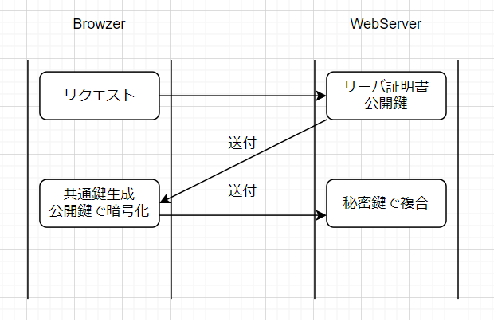

# 本ドキュメントの対象範囲
Web Developers loadMap_Backend 2021のロードマップにおける
Httpの基礎を扱う。
Httpは通信プロトコルの1種であり、
意識せずともフレームワークがある程度ラップしてくれるが
REST APIの思想やhttpsの誕生背景を知るために理解する必要がある。

# What's Http?
Httpは通信プロトコルの１種であり、**「WebサーバとのHtmlのやり取り」**
を行うときの予約語である。（プロトコル = 予約語）
ファイル送信はFTP,インターネット通信はTCPといったように、あらかじめ指定されている。

# HttpとHttpsの違い。
Http通信はHTML文書のやり取りをサーバと行う際に指定するプロトコルだが、
**通信途中の暗号化がされない。**という問題点があった。
以下のPython + Flaskで作成したコードは、
**プログラム単体では**通信内容の暗号化をしていない。

```python test.py
from flask import Flask
app = Flask(__name__)

@app.route('/')
def hello() :
   return 'Hello World!!' 

if __name__ = '__main__'
    app.run(debug=True)
```

通信内容の暗号化がされていないと、通信中のデータに対して攻撃を行うと
秘密にしておきたいデータを盗み見されてしまう恐れがある。
それを解消するために策定された新たなプロトコルが**https**である。

# httpsによる暗号化とその条件。
httpsは暗号化を行う。何も考えずにできるものではなく、準備が必要である。
暗号化方式には**SSL**を利用する。SSLは暗号化方式の１つであり、
証明書と公開鍵をサーバから送信し、ブラウザで共通鍵を生成、
再度サーバへ暗号化した共通鍵を送付、それをサーバ側秘密鍵で複合
という手順を踏むことでHTTP通信の暗号化を行う暗号化方式である。


この方式を用いると、secureな通信が確保され、SEO対策の面でも有利になる。

また、http通信を用いているとブラウザによっては警告が表示されてしまう。

# HTTP通信の応答
Http通信でレスポンスを返す際に、応答コード、ヘッダが返却される。
それぞれの応答コードのクラスは5つ。

- 情報レスポンス(1xx)
- 成功レスポンス(2xx)
- リダイレクト(3xx)
- クライアントエラー(4xx)
- サーバエラー(5xx)

|  コード  | 種類  |
| ---- | ---- |
|  1xx  |  情報レスポンス  |
|  2xx  |  成功レスポンス  |
|  3xx  |  リダイレクトレスポンス  |
|  4xx  |  クライアントエラーレスポンス  |
|  5xx  |  サーバエラーレスポンス  |

これら以外の応答を定義する事ができるが、基本はこれら5種のいずれかが返却される。
例：200 OK 400 Bad Request 等

# HttpリクエストとREST
Httpリクエストは主流なのは4種類あり、どのブラウザでもどのサーバでも利用できる。

|  リクエスト  |  概要  |
| ---- | ---- |
|  GET  |  指定リソースの取得を要求  |
|  POST  | 指定リソースの状態を送信  |
|  PUT  | 指定リソースの更新  |
|  DELETE  | 指定リソースの削除  |

これらはHttpリクエストの仕様として策定されており、扱うプログラミング言語の影響を受けない。
このリクエストを用いて統一性を持たせた思想がREST APIである。

